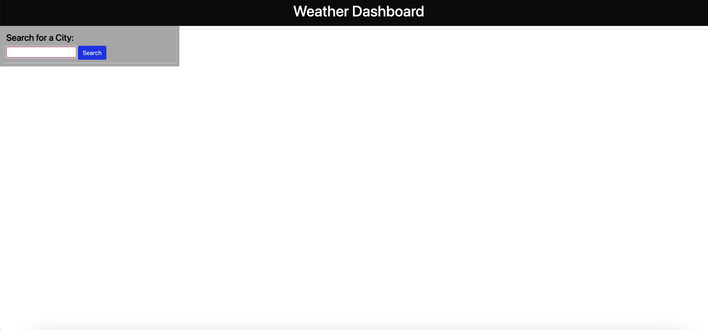
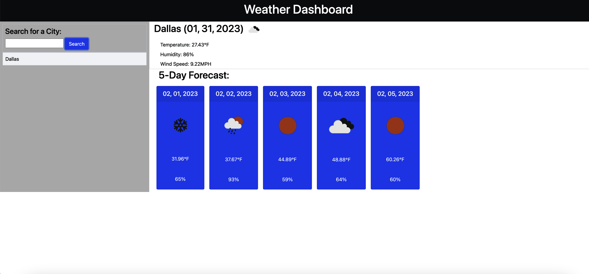
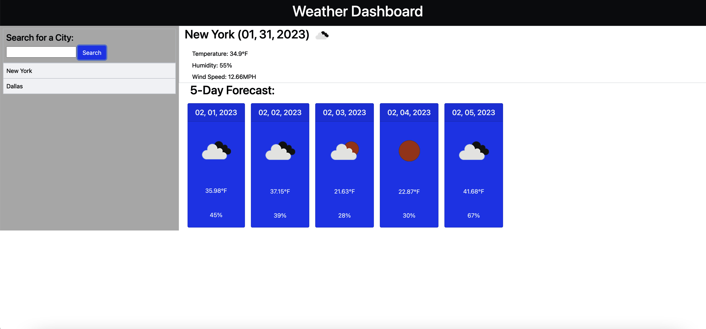
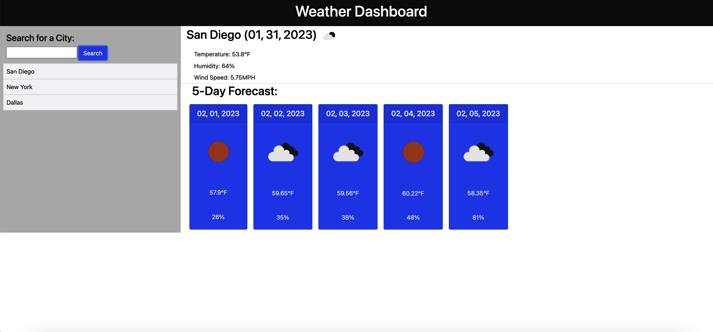

# Server-Side-APIs-Weather-Dashboard

## Description

In this challenge I created a page for users to check 5-day weather for whatever city they may be visiting. You will see the temp, humidity, and wind speed of each city for the next 5 days.

[Link to deployed application](https://saraschroeder.github.io/Server-Side-APIs-Weather-Dashboard/)

## Installation

N/A

## Usage

In order to run my application you'll want to begin with inputting your city and selecting "Search" and your city will pop up with the weather for the following 5 days. When you continue inputting different cities but want to go back to a previous one, you may just click on that city and it'll pull up the weather instead of having to re-type it in.

## Credits

N/A

## License

[MIT](https://choosealicense.com/licenses/mit/)